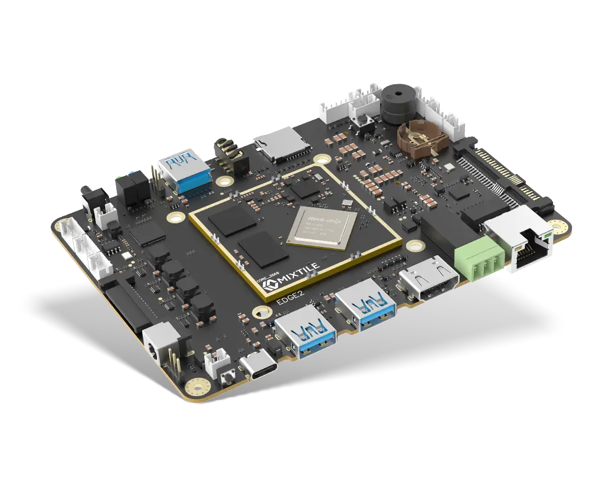
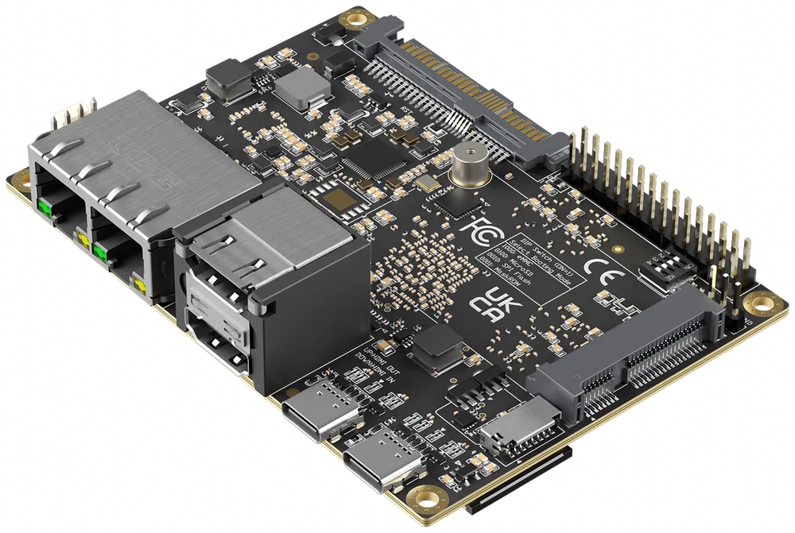
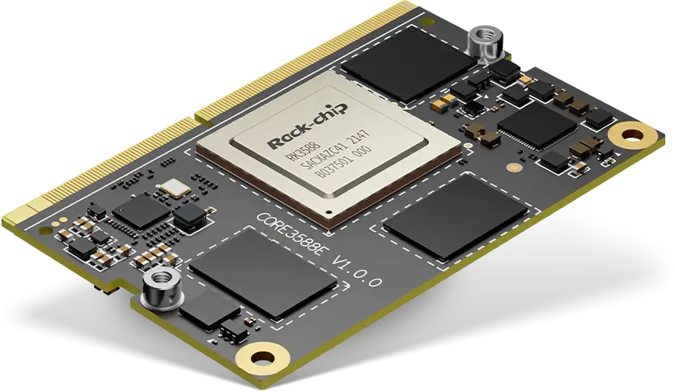

<p align="center">
  
</p>

<h1 align="center">Mixtile OS</h1>

<p align="center">
  Mixtile's official operating system for the Mixtile Edge 2, Blade 3 and Core 3588E, based on Ubuntu and Debian.
</p>

<p align="center">
  <a href="https://github.com/mixtile-rockchip/mixtile-os/releases/latest"></a>
  <a href="https://github.com/mixtile-rockchip/mixtile-os/releases"></a>
</p>

## Highlights

* Ubuntu 24.04 LTS, Ubuntu 26.04 LTS, Debian 12 and Debian 13, each in a server and a GNOME desktop edition
* Rockchip vendor Linux 6.1 kernel
* 3D acceleration on the Mali GPU with Mesa OpenGL and Vulkan drivers (desktop edition)
* Hardware video decoding and encoding through Rockchip MPP, integrated with FFmpeg and GStreamer
* 2D acceleration through Rockchip RGA
* NPU inference through the Rockchip RKNN runtime
* Rockchip userspace delivered and updated through the [Mixtile apt archive](https://github.com/mixtile-rockchip/archive), alongside the official Ubuntu and Debian repositories

## Supported Devices

| | Device | SoC | Documentation |
|:---:|---|---|---|
|  | [Mixtile Edge 2](https://www.mixtile.com/edge-2/) | Rockchip RK3568 | [Docs](https://www.mixtile.com/categories/mixtile-edge-2-kit/) |
|  | [Mixtile Blade 3](https://www.mixtile.com/blade-3/) | Rockchip RK3588 | [Docs](https://www.mixtile.com/categories/mixtile-blade-3-docs/) |
|  | [Mixtile Core 3588E](https://www.mixtile.com/core-3588e/) | Rockchip RK3588 | [Docs](https://www.mixtile.com/categories/mixtile-core-3588e/) |

See the documentation for your device for the USB port, Maskrom mode and
other hardware-specific installation details.

## Installation

### Download

Pick the system and edition for your device. All images are also on the
[latest release](https://github.com/mixtile-rockchip/mixtile-os/releases/latest) page.

| System | Edge 2 | Blade 3 | Core 3588E |
|---|---|---|---|
| Ubuntu 24.04 LTS | [Server](https://github.com/mixtile-rockchip/mixtile-os/releases/latest/download/ubuntu-24.04-server-arm64-mixtile-edge2.img.xz) · [Desktop](https://github.com/mixtile-rockchip/mixtile-os/releases/latest/download/ubuntu-24.04-desktop-arm64-mixtile-edge2.img.xz) | [Server](https://github.com/mixtile-rockchip/mixtile-os/releases/latest/download/ubuntu-24.04-server-arm64-mixtile-blade3.img.xz) · [Desktop](https://github.com/mixtile-rockchip/mixtile-os/releases/latest/download/ubuntu-24.04-desktop-arm64-mixtile-blade3.img.xz) | [Server](https://github.com/mixtile-rockchip/mixtile-os/releases/latest/download/ubuntu-24.04-server-arm64-mixtile-core3588e.img.xz) · [Desktop](https://github.com/mixtile-rockchip/mixtile-os/releases/latest/download/ubuntu-24.04-desktop-arm64-mixtile-core3588e.img.xz) |
| Ubuntu 26.04 LTS | [Server](https://github.com/mixtile-rockchip/mixtile-os/releases/latest/download/ubuntu-26.04-server-arm64-mixtile-edge2.img.xz) · [Desktop](https://github.com/mixtile-rockchip/mixtile-os/releases/latest/download/ubuntu-26.04-desktop-arm64-mixtile-edge2.img.xz) | [Server](https://github.com/mixtile-rockchip/mixtile-os/releases/latest/download/ubuntu-26.04-server-arm64-mixtile-blade3.img.xz) · [Desktop](https://github.com/mixtile-rockchip/mixtile-os/releases/latest/download/ubuntu-26.04-desktop-arm64-mixtile-blade3.img.xz) | [Server](https://github.com/mixtile-rockchip/mixtile-os/releases/latest/download/ubuntu-26.04-server-arm64-mixtile-core3588e.img.xz) · [Desktop](https://github.com/mixtile-rockchip/mixtile-os/releases/latest/download/ubuntu-26.04-desktop-arm64-mixtile-core3588e.img.xz) |
| Debian 12 | [Server](https://github.com/mixtile-rockchip/mixtile-os/releases/latest/download/debian-12-server-arm64-mixtile-edge2.img.xz) · [Desktop](https://github.com/mixtile-rockchip/mixtile-os/releases/latest/download/debian-12-desktop-arm64-mixtile-edge2.img.xz) | [Server](https://github.com/mixtile-rockchip/mixtile-os/releases/latest/download/debian-12-server-arm64-mixtile-blade3.img.xz) · [Desktop](https://github.com/mixtile-rockchip/mixtile-os/releases/latest/download/debian-12-desktop-arm64-mixtile-blade3.img.xz) | [Server](https://github.com/mixtile-rockchip/mixtile-os/releases/latest/download/debian-12-server-arm64-mixtile-core3588e.img.xz) · [Desktop](https://github.com/mixtile-rockchip/mixtile-os/releases/latest/download/debian-12-desktop-arm64-mixtile-core3588e.img.xz) |
| Debian 13 | [Server](https://github.com/mixtile-rockchip/mixtile-os/releases/latest/download/debian-13-server-arm64-mixtile-edge2.img.xz) · [Desktop](https://github.com/mixtile-rockchip/mixtile-os/releases/latest/download/debian-13-desktop-arm64-mixtile-edge2.img.xz) | [Server](https://github.com/mixtile-rockchip/mixtile-os/releases/latest/download/debian-13-server-arm64-mixtile-blade3.img.xz) · [Desktop](https://github.com/mixtile-rockchip/mixtile-os/releases/latest/download/debian-13-desktop-arm64-mixtile-blade3.img.xz) | [Server](https://github.com/mixtile-rockchip/mixtile-os/releases/latest/download/debian-13-server-arm64-mixtile-core3588e.img.xz) · [Desktop](https://github.com/mixtile-rockchip/mixtile-os/releases/latest/download/debian-13-desktop-arm64-mixtile-core3588e.img.xz) |

### Extract

The images are compressed with xz (`.img.xz`). Extract the `.img` file before
flashing it.

### Flash to eMMC

Mixtile OS runs from the device's eMMC. Flash it with
[Rockchip Flash Tool](https://github.com/mixtile-rockchip/rockchip-flash-tool),
available for macOS, Windows and Linux:

1. Install Rockchip Flash Tool from its
   [latest release](https://github.com/mixtile-rockchip/rockchip-flash-tool/releases/latest).
2. Connect the device to your computer over USB and put it into Maskrom mode.
3. Open Rockchip Flash Tool; it shows the connected device and its mode.
4. Select the extracted `.img` file and click **Start Flash**.
5. Wait until the tool reports **Flash completed**.

## Boot the System

1. Disconnect the USB cable used for flashing.
2. Restore the device's normal boot setting if you changed one to enter
   Maskrom mode.
3. Power on the device.

The server edition boots to a login prompt. The desktop edition starts GNOME.

## Login Information

The predefined user is `mixtile` and the password is `mixtile`. Change the
password after your first login with `passwd`.

Both editions accept logins through HDMI, the serial console (`ttyS2`,
1500000 baud) and SSH. The hostname follows the board name used in the image,
for example `mixtile-edge2`.

On the desktop edition, the `mixtile` user is logged in to GNOME automatically
on HDMI.

## Build from Source

### Requirements

* An x86_64 computer running Ubuntu 24.04, with root access
* An internet connection; the build downloads the kernel, U-Boot and all packages
* The build dependencies:

```bash
sudo apt-get update
sudo apt-get install -y --no-install-recommends \
    ca-certificates curl wget git file xz-utils zstd bzip2 patch lsb-release \
    dctrl-tools mmdebstrap arch-test qemu-user-static binfmt-support \
    debian-archive-keyring ubuntu-keyring gpg gpg-agent dirmngr apt-utils \
    build-essential debhelper devscripts dpkg-dev fakeroot quilt \
    gcc-aarch64-linux-gnu bc bison flex libssl-dev libelf-dev dwarves kmod \
    cpio rsync python3 python3-dev python3-setuptools python3-pyelftools \
    python-is-python3 swig libpython3-dev u-boot-tools device-tree-compiler \
    libfdt-dev libgnutls28-dev uuid-dev parted fdisk gdisk dosfstools \
    e2fsprogs uuid-runtime util-linux udev
```

### Quick Build

```bash
git clone https://github.com/mixtile-rockchip/mixtile-os.git
cd mixtile-os
sudo ./build.sh --board=mixtile-edge2 --suite=noble --flavor=server
```

The image and its checksum are written to `images/`:

```
images/ubuntu-24.04-server-arm64-mixtile-edge2.img.xz
images/ubuntu-24.04-server-arm64-mixtile-edge2.img.xz.sha256
```

Build logs are kept in `build/logs/`.

### Options

| Option | Values |
|---|---|
| `--board` | `mixtile-edge2`, `mixtile-blade3`, `mixtile-core3588e` |
| `--suite` | `noble` (Ubuntu 24.04 LTS), `resolute` (Ubuntu 26.04 LTS), `bookworm` (Debian 12), `trixie` (Debian 13) |
| `--flavor` | `server`, `desktop` |
| `--kernel` | `vendor` (default) |

`--board`, `--suite` and `--flavor` are required. Pass `help` to any of them to
list its values, for example `sudo ./build.sh --board=help`.

| Option | Effect |
|---|---|
| `-c`, `--clean` | Remove `build/` and start over |
| `-uo`, `--uboot-only` | Build U-Boot only (needs `--board`) |
| `-ko`, `--kernel-only` | Build the kernel only |
| `-ro`, `--rootfs-only` | Build the root filesystem only (needs `--suite` and `--flavor`) |
| `-v`, `--verbose` | Print every command as it runs |
| `-h`, `--help` | Show usage (`sudo ./build.sh --help`) |

## Support

* [Mixtile Documentation](https://www.mixtile.com/documentation/)
* [Mixtile Community](https://community.mixtile.com/)
* [Report an issue](https://github.com/mixtile-rockchip/mixtile-os/issues)
